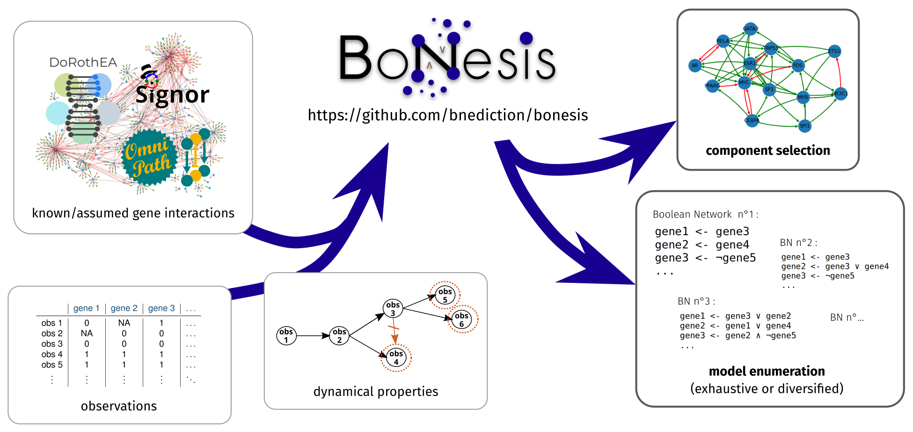

## Overview of my doctorate

I have contributed in the development of a tool for <important>automatic inference of discrete dynamical models of biological interactions</important>, called <important>BoNesis</important>. This tool makes it possible to **model regulatory mechanisms of biological processes with complex dynamic properties**, such as cell differentiation, by taking into account **knowledge on thousands of genes**.

[{:class="img-page"}](https://github.com/bnediction/bonesis)

This modeling confronts **prior knowledge** on interactions with **observations** along the process to model (bulk/single cell gene expressions, perturbations, mutations...). It can then <important>enumerate all Boolean networks reproducing a complex behavior</important> (under _[mp semantics](https://hal.archives-ouvertes.fr/hal-01864693v2/document)_), e.g. cell differentiation. It can also be used to help <important>select relevant nodes among a large prior knowledge network</important> (e.g. from public interaction databases).

## Research motivation

**The holistic approach of systems biology** suits with the way I spontaneously look at my environment and explore the behaviors we witness all around us. I have a passion for **understanding the grounds controlling biological and social behaviors**, for trying to untangle and predict their dynamics.

I am particularly interested in metabolism due to a chronic disease I suffer from, which is still very poorly understood by science.
I dream of one day being able to devote my skills to scientific research on this issue.

### Interest in Bioinformatics

Trained in bioinformatics, I have looked in different areas of this discipline through internships: the challenge of **data integration**, **NGS analysis**, **structural analysis** for drug design, and finally the one of complex **biological systems analysis and modelling**. These experiences gave me the chance to approach related issues from different viewpoints. The interdisciplinary interactions inherent in bioinformatics are an important motivation for me, intensified in systems biology.

The research topics in which I have mainly developed my skills through the doctorate are **discrete dynamical modelling** and **logic programming**. I also notably became aware of the opportunities and biases of **single-cell data**.
