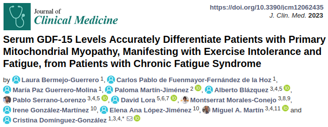

# Veille bibliographique sur l'EM/SFC

## Travaux à feuilleter (résumé à venir) :

**Immuno / endocrino :**
   - [Autoantibodies to selenoprotein P in chronic fatigue syndrome suggest selenium transport impairment and acquired resistance to thyroid hormone](https://www.ncbi.nlm.nih.gov/pmc/articles/PMC10338150/), Sun et al., Redox Biology, 2023/07

**Neuro, travaux de Angus Mackay :**
   - [A neuroinflammatory paradigm can explain Myalgic Encephalomyelitis/Chronic Fatigue Syndrome and Post-COVID-19 Fatigue Syndrome](https://ourarchive.otago.ac.nz/handle/10523/15089), manuscrit de thèse, 2023/03
   - [A Paradigm for Post-Covid-19 Fatigue Syndrome Analogous to ME/CFS](https://www.frontiersin.org/articles/10.3389/fneur.2021.701419/full), Frontiers in Neurology, 2021/08
   - [A neuro-inflammatory model can explain the onset, symptoms and flare-ups of myalgic encephalomyelitis/chronic fatigue syndrome](https://www.publish.csiro.au/hc/HC19041), J. of Primary Health Care, 2019/11
   - [Current Research Provides Insight into the Biological Basis and Diagnostic Potential for Myalgic Encephalomyelitis/Chronic Fatigue Syndrome (ME/CFS)](https://www.mdpi.com/2075-4418/9/3/73), Diagnostics, 2019/07

## Résumés de publications 2022 et 2023 :
<small_emphasis>(pour journal club en français)</small_emphasis>

----

### Résultats positifs (i.e. résultat statistiquement significatif qui appuie une hypothèse) :

#### --- Immunologie ---
  + <important>Altération de l'influx calcique dépendant du TRPM7 dans les lymphocytes NK de patients EM/SFC.</important>  
  [{:class="img-vignette"}](../files/EMSFC/2023-06_TRPM7.html)  
  

  + <important>Les changements transcriptomiques induits par l'exercice chez des femmes EM/SFC révèlent des signatures immunitaires perturbées.</important>  
  [{:class="img-vignette"}](../files/EMSFC/2023-01_Exercice-transcriptomic-changes.pdf)

#### --- Métabolisme ---
  + <important>Comparaison des taux sériques d'acylcarnitine chez patients EM/SFC vs témoins : revue systématique et méta-analyse.</important>  
  [{:class="img-vignette"}](../files/EMSFC/2023-06_acylcarnitine.html)  
  

  + <important>Différencier la myopathie mitochondriale primaire (se manifestant par intolérance à l'effort et fatigue) de l'EM/SFC grâce au taux sériques de GDF-15.</important>  
  [{:class="img-vignette"}](../files/EMSFC/2023-03_GDF15-differentiate-patients.html)  
  

  + <important>La consommation d'oxygène comme biomarqueur pour le diagnostic de la fatigue chronique.</important>  
  [{:class="img-vignette"}](../files/EMSFC/2022-03_Oxygen-biomarker.pdf)  
  

  + <important>Teneur en sodium plus élevée dans les muscles de patients EM/SFC.</important>  
  [{:class="img-vignette"}](../files/EMSFC/2022-12_Muscle-sodium-content.pdf)

#### --- Microbiome intestinal ---
  + <important>Dans l'EM/SFC, association entre production insuffisante de butyrate dans le microbiome intestinal et perturbations du réseau bactérien + symptômes de fatigue.</important>  
  [{:class="img-vignette"}](../files/EMSFC/2023-02_Gut-microbiome-butyrate.html)

#### --- Angiologie ---
  + <important>Dysfonction endothéliale chez patients EM/SFC : dilatation médiée par le flux et hyperémie réactive réduites.</important>  
  [{:class="img-vignette"}](../files/EMSFC/2023-02_Endothelial-dysfonction.pdf)

#### --- Biologie moléculaire ---
  + <important>Distinction entre EM/SFC, fibromyalgie et affections comorbides grâce aux profils d'expression de microARN circulants.</important>  
  [{:class="img-vignette"}](../files/EMSFC/2023-02_Circulating-miRNA.pdf)

<!--### --- 2016 ---
+  [{:class="img-vignette"}](../files/EMSFC/2016-06_MM-vs-SFC.html)-->

----

### Résultats négatifs (i.e. résultat n'ayant pas permis de confirmer une hypothèse)

#### --- Immunologie ---
  + <important>Comparaison de la diversité des récepteurs des lymphocytes T entre EM/SFC et témoins.</important>  
  [{:class="img-vignette"}](../files/EMSFC/2023-07_Tcell.html)  

<!-- + [{:class="img-vignette"}](../files/EMSFC/2023-06_circRNA.html)  

-->
